# Modelo de datos del MVP — TransportExperience

20 tablas en una sola migración inicial
(`alembic/versions/2026_09_29_1050-05ddce1f9e8a_modelo_inicial_del_mvp.py`).
El diagrama de abajo se genera desde los modelos con `python -m scripts.generar_diagrama_er`;
no se edita a mano.

## Tablas por módulo

| Módulo | Tablas | Historias |
|---|---|---|
| usuarios | `usuarios` | HU-12 |
| inventario | `tipos_vehiculo`, `modelos_vehiculo`, `vehiculos`, `productos`, `novedades_vehiculo` | HU-02, HU-09, HU-10 |
| alquileres | `alquileres` | HU-03 |
| ventas | `ventas`, `items_venta` | HU-04 |
| pagos | `metodos_pago`, `pagos`, `eventos_pago` | HU-05 |
| domicilios | `zonas_cobertura`, `domicilios`, `historial_estados_domicilio` | HU-06, HU-07 |
| rastreo | `posiciones_gps` | HU-08 |
| reportes | `actas` | HU-11 |
| portal | `contenido_portal`, `horarios_atencion` | HU-01, SRS 3.5.3 |
| (transversal) | `auditoria` | SRS 3.5.4 |

## Reglas que garantiza la base de datos

Estas reglas no dependen de que el código de Python esté bien: si un servicio tiene un
error, la base rechaza el dato.

| Regla | Cómo |
|---|---|
| Un vehículo no se alquila dos veces en fechas que se cruzan (SRS 3.3.3) | `ex_alquileres_sin_solapamiento`: restricción de exclusión GiST sobre `vehiculo_id` y `daterange(fecha_inicio, fecha_fin)` para alquileres activos |
| No se vende más stock del que hay | `ck_productos_stock_no_negativo` (`stock >= 0`) |
| No se cobra dos veces lo mismo | `uq_pagos_*_cobro_aprobado`: índices únicos parciales, un solo cobro aprobado por alquiler o venta |
| Los totales cuadran | `ck_alquileres_subtotal_cuadra` (días × tarifa), `ck_*_total_cuadra` (subtotal + envío) |
| Un webhook repetido no se procesa dos veces | `uq_eventos_pago_clave_idempotencia` |
| Un vehículo de la flota no está en dos entregas en ruta | `uq_domicilios_vehiculo_en_ruta` |
| Un solo domicilio vigente por alquiler o venta | `uq_domicilios_alquiler_activo`, `uq_domicilios_venta_activo` |
| Cada pago cobra exactamente un alquiler o una venta | `ck_pagos_una_sola_operacion` (`num_nonnulls(...) = 1`) |
| Cada domicilio entrega exactamente un alquiler o una venta | `ck_domicilios_entrega_alquiler_o_venta` |
| Un pago aprobado no se edita; se compensa | `tipo = 'compensacion'` exige `pago_compensado_id` |
| El subtotal de cada ítem cuadra | `ck_items_venta_subtotal_cuadra` |
| Solo existen estados válidos | un `CHECK` por cada columna de estado |

Las **transiciones** entre estados (por ejemplo, que `vendido` sea terminal) no están en
la base: viven en el `servicio.py` de cada módulo y tienen sus propios tests.

## Decisiones de diseño

- **Dinero** en `bigint`, pesos enteros. Nunca `float`.
- **Precios copiados.** `alquileres.tarifa_diaria`, `items_venta.precio_unitario` y
  `valor_envio` (en alquileres y ventas) guardan el valor del momento: si el administrador
  cambia una tarifa, las operaciones ya hechas no se alteran.
- **Un solo pago con el envío incluido.** El alquiler o la venta guardan el desglose
  (`subtotal`, `valor_envio`, `total`) y el pago cubre el `total`. El domicilio no guarda
  valor propio: el envío vive en la operación que entrega.
- **Estado físico vs. fechas.** `vehiculos.estado` es solo el estado físico de hoy. La
  disponibilidad por fechas sale de `alquileres`, con fechas inclusivas: del 5 al 7 son
  3 días y el siguiente cliente puede recoger desde el día 8.
- **Fuera de cobertura se bloquea** (SRS 3.6.1): `domicilios.zona_id` es obligatorio.
- **Vehículo vs. modelo.** `vehiculos` es la unidad física (código, estado, batería).
  `modelos_vehiculo` es la ficha del catálogo (nombre, foto, tarifa diaria, precio de
  venta) compartida por las unidades iguales. Un modelo sin `tarifa_diaria` no se alquila;
  uno sin `precio_venta` no se vende.
- **Bloqueo de 15 minutos.** Un alquiler o una venta en `pendiente_pago` tiene `expira_en`.
  Al crear una reserva nueva, el servicio primero marca como `expirado` los bloqueos
  vencidos de ese vehículo, en la misma transacción.
- **Zonas** como GeoJSON en `jsonb`, sin PostGIS. La validación de "punto dentro del
  polígono" es una función propia en Python, con tests y sin dependencias nuevas (HU-06).
- **Actas (HU-11):** los campos de conformidad (`conforme_por_id`, `conforme_en`,
  `hash_pdf`) están **pendientes de confirmar con el equipo** (contradicción 6 del
  CLAUDE.md).
- **Estados como texto con CHECK**, no como ENUM nativo de Postgres: agregar un estado
  después es una migración de una línea.

## Diagrama entidad-relación

```mermaid
erDiagram
    actas {
        integer id PK
        varchar tipo "entrega | recepcion"
        integer vehiculo_id FK
        integer alquiler_id FK
        integer venta_id FK
        integer domicilio_id FK
        text estado_vehiculo
        smallint nivel_bateria
        integer registrada_por_id FK
        timestamptz creado_en
        integer conforme_por_id FK
        timestamptz conforme_en
        varchar hash_pdf
    }
    alquileres {
        integer id PK
        integer cliente_id FK
        integer vehiculo_id FK
        date fecha_inicio
        date fecha_fin
        bigint tarifa_diaria
        bigint subtotal
        bigint valor_envio
        bigint total
        varchar estado "pendiente_pago | confirmado | en_curso | finalizado | cancelado | expirado"
        timestamptz expira_en
        text motivo_cancelacion
        timestamptz creado_en
        timestamptz actualizado_en
    }
    auditoria {
        bigint id PK
        integer usuario_id FK
        varchar accion
        varchar entidad
        varchar entidad_id
        jsonb datos_anteriores
        jsonb datos_nuevos
        timestamptz ocurrido_en
    }
    contenido_portal {
        integer id PK
        varchar seccion UK
        varchar titulo
        text contenido
        timestamptz actualizado_en
    }
    domicilios {
        integer id PK
        varchar codigo_rastreo UK
        integer cliente_id FK
        integer alquiler_id FK
        integer venta_id FK
        integer zona_id FK
        varchar direccion
        varchar indicaciones
        numeric latitud
        numeric longitud
        varchar estado "pendiente | asignado | recogido | en_camino | entregado | cancelado"
        integer domiciliario_id FK
        integer vehiculo_transporte_id FK
        timestamptz entregado_en
        text motivo_cancelacion
        timestamptz creado_en
        timestamptz actualizado_en
    }
    eventos_pago {
        bigint id PK
        varchar proveedor
        varchar clave_idempotencia UK
        integer pago_id FK
        boolean firma_valida
        varchar estado_reportado
        text cuerpo_crudo
        boolean procesado
        text error
        timestamptz recibido_en
    }
    historial_estados_domicilio {
        integer id PK
        integer domicilio_id FK
        varchar estado_anterior "pendiente | asignado | recogido | en_camino | entregado | cancelado"
        varchar estado_nuevo "pendiente | asignado | recogido | en_camino | entregado | cancelado"
        integer cambiado_por_id FK
        timestamptz cambiado_en
    }
    horarios_atencion {
        integer id PK
        smallint dia_semana UK
        time hora_apertura
        time hora_cierre
    }
    items_venta {
        integer id PK
        integer venta_id FK
        integer vehiculo_id FK
        integer producto_id FK
        integer cantidad
        bigint precio_unitario
        bigint subtotal
    }
    metodos_pago {
        integer id PK
        varchar codigo UK
        varchar nombre
        boolean activo
        timestamptz creado_en
        timestamptz actualizado_en
    }
    modelos_vehiculo {
        integer id PK
        integer tipo_vehiculo_id FK
        varchar marca
        varchar nombre
        text descripcion
        varchar imagen_url
        bigint tarifa_diaria
        bigint precio_venta
        boolean activo
        timestamptz creado_en
        timestamptz actualizado_en
    }
    novedades_vehiculo {
        integer id PK
        integer vehiculo_id FK
        varchar tipo "dano | falla | perdida_accesorio | bateria_baja | incidente | mantenimiento"
        text descripcion
        boolean es_critica
        varchar estado "abierta | cerrada"
        integer reportada_por_id FK
        timestamptz creado_en
        integer cerrada_por_id FK
        timestamptz cerrada_en
        text solucion
    }
    pagos {
        integer id PK
        varchar referencia UK
        varchar tipo "cobro | compensacion"
        integer alquiler_id FK
        integer venta_id FK
        integer metodo_pago_id FK
        bigint monto
        varchar estado "pendiente | aprobado | rechazado | expirado | error"
        varchar proveedor
        varchar id_transaccion_pasarela UK
        integer pago_compensado_id FK
        timestamptz aprobado_en
        text detalle_error
        timestamptz creado_en
        timestamptz actualizado_en
    }
    posiciones_gps {
        bigint id PK
        integer vehiculo_id FK
        numeric latitud
        numeric longitud
        numeric precision_metros
        numeric velocidad_kmh
        smallint nivel_bateria
        varchar fuente "simulador | dispositivo"
        timestamptz registrado_en
        timestamptz recibido_en
    }
    productos {
        integer id PK
        varchar codigo UK
        varchar nombre
        varchar categoria "accesorio | repuesto"
        text descripcion
        varchar imagen_url
        bigint precio_venta
        integer stock
        integer stock_minimo
        boolean activo
        timestamptz creado_en
        timestamptz actualizado_en
    }
    tipos_vehiculo {
        integer id PK
        varchar nombre UK
        boolean usa_bateria
        boolean activo
        timestamptz creado_en
        timestamptz actualizado_en
    }
    usuarios {
        integer id PK
        varchar nombre_completo
        varchar correo UK
        varchar telefono
        varchar hash_contrasena
        varchar rol "cliente | administrador | operador | domiciliario"
        boolean activo
        timestamptz creado_en
        timestamptz actualizado_en
    }
    vehiculos {
        integer id PK
        varchar codigo UK
        integer modelo_id FK
        varchar estado "disponible | reservado | alquilado | vendido | mantenimiento | asignado_a_domicilio"
        smallint nivel_bateria
        varchar ubicacion
        text observaciones
        timestamptz creado_en
        timestamptz actualizado_en
    }
    ventas {
        integer id PK
        integer cliente_id FK
        varchar estado "pendiente_pago | pagada | cancelada | expirada"
        bigint subtotal
        bigint valor_envio
        bigint total
        timestamptz expira_en
        timestamptz creado_en
        timestamptz actualizado_en
    }
    zonas_cobertura {
        integer id PK
        varchar nombre UK
        jsonb poligono
        bigint tarifa_envio
        boolean activa
        timestamptz creado_en
        timestamptz actualizado_en
    }
    alquileres |o--o{ actas : "alquiler_id"
    alquileres |o--o{ domicilios : "alquiler_id"
    alquileres |o--o{ pagos : "alquiler_id"
    domicilios |o--o{ actas : "domicilio_id"
    domicilios ||--o{ historial_estados_domicilio : "domicilio_id"
    metodos_pago ||--o{ pagos : "metodo_pago_id"
    modelos_vehiculo ||--o{ vehiculos : "modelo_id"
    pagos |o--o{ eventos_pago : "pago_id"
    pagos |o--o{ pagos : "pago_compensado_id"
    productos |o--o{ items_venta : "producto_id"
    tipos_vehiculo ||--o{ modelos_vehiculo : "tipo_vehiculo_id"
    usuarios |o--o{ actas : "conforme_por_id"
    usuarios |o--o{ auditoria : "usuario_id"
    usuarios |o--o{ domicilios : "domiciliario_id"
    usuarios |o--o{ historial_estados_domicilio : "cambiado_por_id"
    usuarios |o--o{ novedades_vehiculo : "cerrada_por_id"
    usuarios ||--o{ actas : "registrada_por_id"
    usuarios ||--o{ alquileres : "cliente_id"
    usuarios ||--o{ domicilios : "cliente_id"
    usuarios ||--o{ novedades_vehiculo : "reportada_por_id"
    usuarios ||--o{ ventas : "cliente_id"
    vehiculos |o--o{ domicilios : "vehiculo_transporte_id"
    vehiculos |o--o{ items_venta : "vehiculo_id"
    vehiculos ||--o{ actas : "vehiculo_id"
    vehiculos ||--o{ alquileres : "vehiculo_id"
    vehiculos ||--o{ novedades_vehiculo : "vehiculo_id"
    vehiculos ||--o{ posiciones_gps : "vehiculo_id"
    ventas |o--o{ actas : "venta_id"
    ventas |o--o{ domicilios : "venta_id"
    ventas |o--o{ pagos : "venta_id"
    ventas ||--o{ items_venta : "venta_id"
    zonas_cobertura ||--o{ domicilios : "zona_id"
```

<!-- inicio:diagrama (generado por scripts/generar_diagrama_er.py; no editar) -->

<!-- fin:diagrama -->
